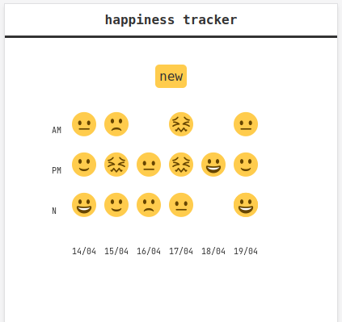
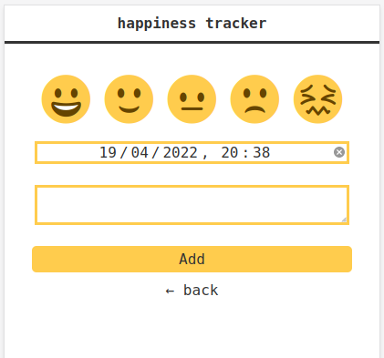

# Happiness tracker 😀️ 🙂️ 😐️ 🙁️ 😖️


## Stack

Django + SQLite + canvas + scss

## What for

Tracking happiness-levels day-to-day




## Install

```
make install && make run
```

## Help

```
make help
```
